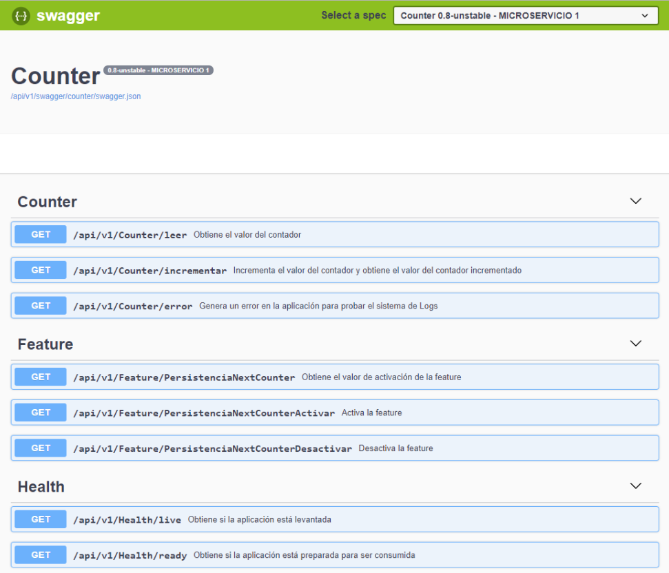
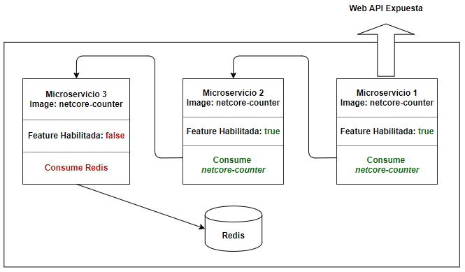
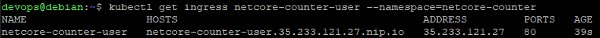
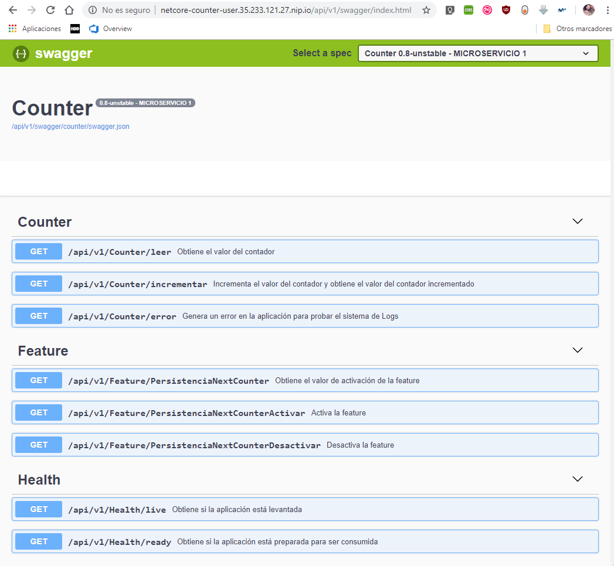

# Counter

Proyecto académico con el objetivo de crear una aplicación *.NET Core* que:

1. Consuma una base de datos.
2. Se pueda ejecutar localmente con [Visual Studio](https://visualstudio.microsoft.com/es/vs/) 2019 (se debe configurar qué servicio Redis externo debe consumir).
3. Se pueda ejecutar localmente con [Docker](https://www.docker.com/) (se debe configurar qué servicio Redis externo debe consumir).
4. Se pueda ejecutar localmente con [Docker-compose](https://docs.docker.com/compose/) levantando un servicio Redis, y con la aplicación configurada para consumirlo.
5. Se pueda ejecutar en un clúster Kubernetes en [GKE](https://cloud.google.com/kubernetes-engine/?hl=es) levantando un servicio Redis, y con la aplicación configurada para consumirlo.
6. Publique mensajes de *log* de la aplicación en formato JSON por la salida estándar.

## Descripción de la aplicación

La aplicación es un servicio Web API simple, que permite utilizar un contador en un servicio Redis, con las siguientes operaciones:

* Leer el contador.
* Incrementar el contador, y devolver el valor del contador incrementado.

Además, tiene:
* Un método auxiliar para generar un error, y comprobar su publicación en el sistema de *Logs*.
* Un cotrolador Health.
* Un controlador Feature.

## Funcionamiento de la aplicación

El API publicado por la aplicación está documentado con [Swagger](https://swagger.io/). Se puede consultar la documentación ejecutando la aplicación, y accediendo a la dirección *http://**host**:**puerto**/api/v1/swagger/index.html*:



La aplicación se puede configurar con el archivo [appsettings.json](./solution/src/Counter.Web/appsettings.json), para establecer, por ejemplo:
* La información de conexión con Redis.
* La información de conexión con otra instancia de esta aplicación.
* La configuración de "*PersistenciaNextCounter*":
  * true: se conecta con otra instancia de esta aplicación.
  * false: se conecta con Redis.

La configuración puede ser sobreescrita por las variables de entorno que se establezcan en el contexto en el que se ejecute.

## Requisitos

Para compilar la aplicación es necesario:

* [SKD de .NET Core](https://dotnet.microsoft.com/download) 2.2.

Para ejecutar la aplicación es necesario:

* [Runtime de .NET Core](https://dotnet.microsoft.com/download/dotnet-core/2.2) 2.2.

Sistema operativo para ejecutar los ejemplos (no es un requisito esencial):

* [Debian 9](https://www.debian.org/index.es.html).

Clonar este repositorio:

```bash
git clone https://github.com/UREURE/netcore-counter.git
```

## Ejecutar localmente la aplicación con Docker

Para la ejecución con **Docker**, es necesario configurar la conexión con un servicio Redis pre-existente en el archivo [appsettings.json](./solution/src/Counter.Web/appsettings.json). Una vez configurada, se puede utilizar:

```bash
cd netcore-counter/solution
chmod 700 *.sh
./start.sh
cd ../..
```

Por defecto, la aplicación estará disponible en:

* [http://localhost:5010/api/v1/swagger/index.html](http://localhost:5010/api/v1/swagger/index.html).


## Ejecutar localmente la aplicación con Docker-compose

Para la ejecución con **Docker-compose**, por defecto se levanta un servicio Redis junto con tres instancias de la aplicación, según la configuración de las variables de entorno en el archivo [.env](./solution/.env). Para ejecutar la configuración de ejemplo se puede utilizar:

```bash
cd netcore-counter/solution
chmod 700 *.sh
./start-compose.sh
cd ../..
```

Esquema de comunicación entre las instancias levantadas en el ejemplo:



Las instancias levantadas de la aplicación aplicación estarán disponibles en:

* Microservicio 1: [http://localhost:5010/api/v1/swagger/index.html](http://localhost:5010/api/v1/swagger/index.html).
* Microservicio 2: [http://localhost:5011/api/v1/swagger/index.html](http://localhost:5011/api/v1/swagger/index.html).
* Microservicio 3: [http://localhost:5012/api/v1/swagger/index.html](http://localhost:5012/api/v1/swagger/index.html).

## Desplegar la aplicación en Kubernetes con GKE

Requisitos:

* Conectar con un clúster Kubernetes de GCP previamente creado en GKE. Por ejemplo, ejecutando:

```bash
gcloud container clusters get-credentials <nombre_clúster_GKE> --zone <zona_clúster_GKE> --project <nombre_proyecto_GCP>
```

* Tener instalado *kubectl*. Si no se tiene instalado, se puede instalar con:

```bash
sudo apt-get install kubectl -y
```

### Sin Helm

Para la ejecución de la aplicación en un clúster de Kubernetes en GKE, se pueden utilizar las imágenes subidas de esta [aplicación](https://hub.docker.com/r/ureure/netcore-counter), y de [Redis](https://hub.docker.com/_/redis), en [Docker Hub](https://hub.docker.com/). Por ejemplo, ejecutando:

```bash
cd netcore-counter/k8s
chmod 700 *.sh
kubectl create namespace netcore-counter
./start-kubernetes.sh <poner_aquí_la_contraseña_que_se_desee_para_el_servicio_Redis> netcore-counter
cd ../..
```

### Con Helm

Instalar *[Helm](https://helm.sh/docs/helm/)*:

```bash
cd netcore-counter/helm
chmod 700 *.sh
./helm_install.sh
cd ../..
```

Instalar la aplicación con Helm:

```bash
cd netcore-counter/charts/netcore-counter/
helm dependency update
cd ..
helm install --name netcore-counter netcore-counter --namespace=netcore-counter
cd ../..
```

## Exponer la aplicación desplegada en Kubernetes

Es necesario tener instalado un *Ingress Controller*. Si no se tiene instalado, se puede instalar el de *[Nginx](https://github.com/kubernetes/ingress-nginx/tree/master/deploy)* con:

```bash
kubectl create clusterrolebinding cluster-admin-binding --clusterrole cluster-admin --user $(gcloud config get-value account)
kubectl apply -f ./netcore-counter/nginx-ingress/mandatory.yaml
kubectl apply -f ./netcore-counter/nginx-ingress/cloud-generic.yaml
```

Esperar a que se se haya asginado una IP en el resultado de ejecutar la siguiente instrucción:

```bash
kubectl get services --all-namespaces | grep LoadBalancer|awk '{print $5};'
```

Crear *Ingress* del servicio *netcore-counter-user*:

```bash
LOAD_BALANCER_IP=$(kubectl get services --all-namespaces|grep LoadBalancer|awk '{print $5};')
sed -i "s/0.0.0.0/$LOAD_BALANCER_IP/g" ./netcore-counter/nginx-ingress/netcore-counter-ingress-user.yaml
kubectl apply -f ./netcore-counter/nginx-ingress/netcore-counter-ingress-user.yaml --namespace=netcore-counter
```

Una vez instalada, se puede ver en qué IP está expuesta la aplicación fuera del clúster con:

```bash
kubectl get ingress netcore-counter-user --namespace=netcore-counter
```



La IP en la que está expuesta la aplicación fuera del clúster está en el campo *HOSTS*. Utilizando [nip.io](https://nip.io/) se puede acceder a la aplicación fácilmente fuera del clúster. En este ejemplo, está expuesta en "[http://netcore-counter.35.233.121.27.nip.io/api/v1/swagger/index.html](http://netcore-counter.35.233.121.27.nip.io/api/v1/swagger/index.html)":


